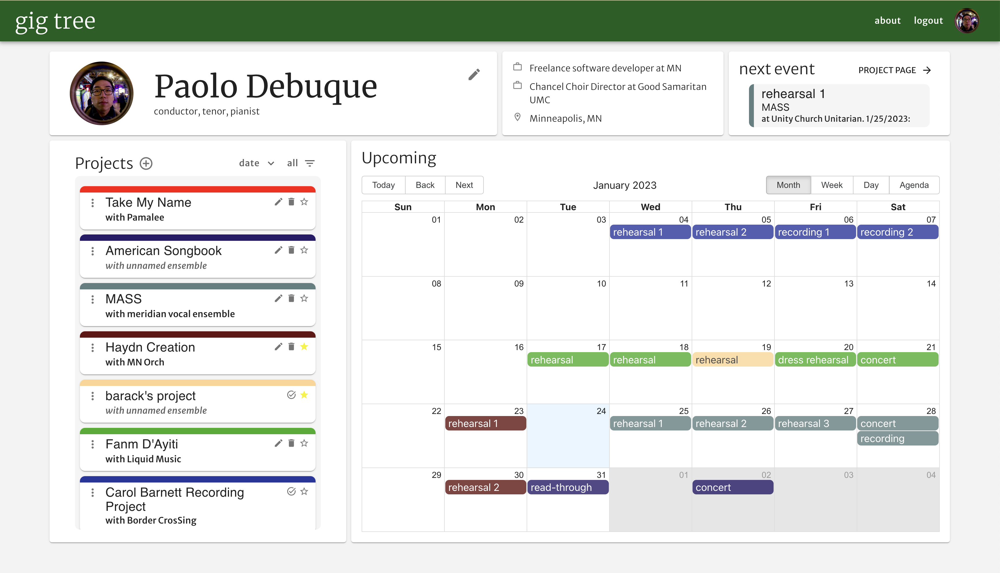
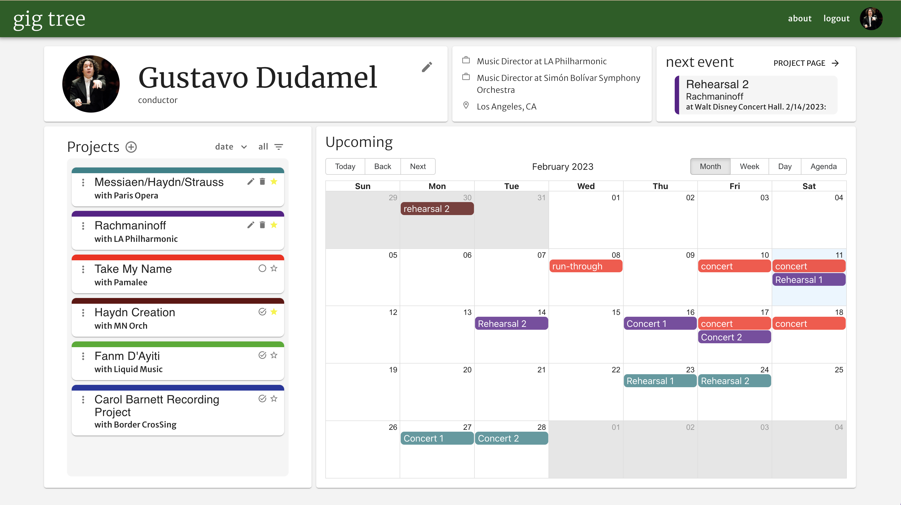
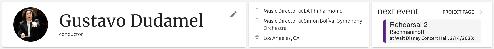
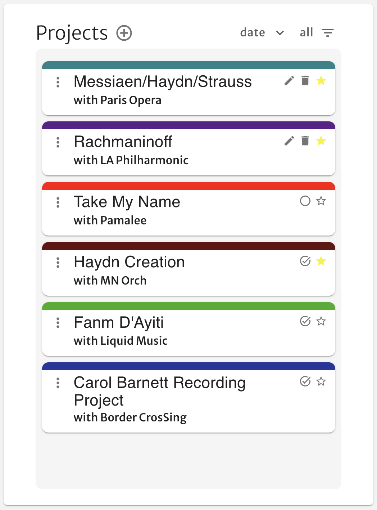
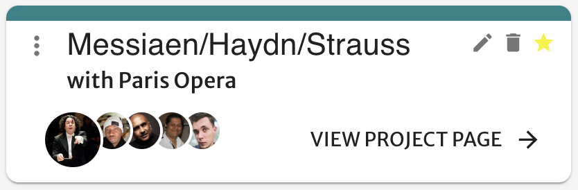
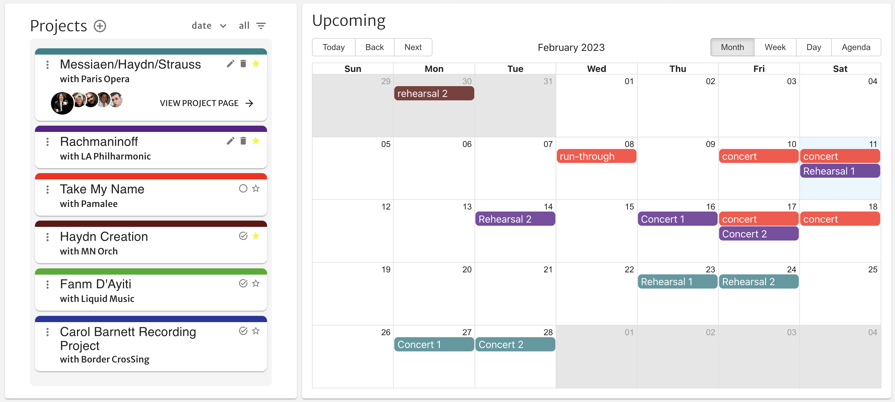

<a name="readme-top"></a>

<!-- PROJECT SHIELDS -->
<!--
*** I'm using markdown "reference style" links for readability.
*** Reference links are enclosed in brackets [ ] instead of parentheses ( ).
*** See the bottom of this document for the declaration of the reference variables
*** for contributors-url, forks-url, etc. This is an optional, concise syntax you may use.
*** https://www.markdownguide.org/basic-syntax/#reference-style-links
-->
[![Contributors][contributors-shield]][contributors-url]
[![Forks][forks-shield]][forks-url]
[![Stargazers][stars-shield]][stars-url]
[![Issues][issues-shield]][issues-url]
[![MIT License][license-shield]][license-url]
[![LinkedIn][linkedin-shield]][linkedin-url]


<!-- PROJECT LOGO -->
<br />
<div align="center">
  <a href="https://github.com/pdebuque/Gig-Tree">
    
  </a>

<h3 align="center">gig tree</h3>

  <p align="center">
    A desktop web application to create, organize, and manage classical music projects.
    <br />
    <a href="https://github.com/pdebuque/Gig-Tree/issues">Report Bug</a>
    ·
    <a href="https://github.com/pdebuque/Gig-Tree/issues">Request Feature</a>
  </p>
</div>

<!-- TABLE OF CONTENTS -->
<details>
  <summary>Table of Contents</summary>
  <ol>
    <li>
      <a href="#about-the-project">About The Project</a>
      <ul>
        <li><a href="#built-with">Built With</a></li>
      </ul>
    </li>
    <li>
      <a href="#getting-started">Getting Started</a>
      <ul>
        <li><a href="#prerequisites">Prerequisites</a></li>
        <li><a href="#installation">Installation</a></li>
      </ul>
    </li>
    <li><a href="#usage">Usage</a></li>
    <li><a href="#roadmap">Roadmap</a></li>
    <li><a href="#contributing">Contributing</a></li>
    <li><a href="#license">License</a></li>
    <li><a href="#contact">Contact</a></li>
    <li><a href="#acknowledgments">Acknowledgments</a></li>
  </ol>
</details>


<!-- ABOUT THE PROJECT -->
## About The Project

I created gig tree in response to a problem I've encountered throughout my time as a freelance classical conductor and singer: the sheer number of overlapping projects I'm involved with, and the lack of a standard communication and scheduling platform. I long ago lost track of the number of emails, texts, facebook messages, etc. etc. I've sent and received to wrangle my gig schedule.

Enter gig tree!

<div align="center">

</div>

The central functionality of this first prototype is the process of creating, editing, and deleting projects, and the development of a dashboard UI that seamlessly centralizes and organizes the user's calendar.

gig tree was my capstone solo project at [Prime Digital Academy](https://www.primeacademy.io/). A deployed version can be accessed [here](https://flyby-events.herokuapp.com/).

<p align="right">(<a href="#readme-top">back to top</a>)</p>


### Built With

[![React][React.js]][React-url]
[![Node][Node.js]][Node-url]
[![Express][Express.js]][Express-url]
[![MUI]][MUI-url]
[![Postgresql]][Postgresql-url]
[![Redux-Saga]][Redux-saga-url]
[![Redux]][Redux-url]
<p align="right">(<a href="#readme-top">back to top</a>)</p>


<!-- GETTING STARTED -->
## Getting Started

### Prerequisites

This app was developed with node 19.0.0 and Chrome 109. Future updates may expand browser and version functionality.

### Installation

1. Clone the repo
   ```sh
   git clone https://github.com/pdebuque/Gig-Tree.git
   ```
2. Install NPM packages
   ```sh
   npm i
   ```
3. Create a `.env` file and enter a randomized session key
   ```
   SERVER_SESSION_SECRET = << RANDOM SESSION KEY HERE >>
   ```
4. Using `gig-tree.sql`, create the database `gig-tree` on localhost, port 5432.
6. Run server
    ```sh
    npm run server
    ```
7. Run client and open browser at `localhost:3000`
    ```sh
    npm run client
    ```


<p align="right">(<a href="#readme-top">back to top</a>)</p>


<!-- USAGE EXAMPLES -->
## Usage


<div align="center">
  
</div>

Currently, all of the main functionality of the application can be found in the landing page dashboard. Here, the user can update personal information, view, organize, and edit their existing projects, and create new ones.

### Dashboard header
<div align="center">
  
</div>

Here, you can see and edit your personal information, as well as view your next event at a glance.


### project list

<div align="center">
  
</div>

In the bottom left corner of the dashboard is a list of all projects the user is associated with, whether as owner or participant. Owned projects have edit and delete functionality, while participant projects have a checkin icon for users to confirm their participation. All projects can be starred and filtered accordingly.

Users can easily create projects by clicking the plus icon in the header, opening a robust multi-step project creation modal.

### project list item
Clicking the three dots expands a project list item, showing more information, including other invited users and a link to the project's page.

<div align="center">
  
</div>

### calendar
The final piece of the dashboard, the calendar, displays all events from the user's projects, color-coded. Clicking an event opens event-relevant info.

<div align="center">
  
</div>

### additional
In addition to this feature-rich dashboard, each project has its own associated page, to be developed further in future iterations.


<p align="right">(<a href="#readme-top">back to top</a>)</p>


<!-- ROADMAP -->
### Roadmap

Future updates will include:
- User profile pages
- Ensemble profile pages
- Dropbox/Google Docs integration
- Messaging platform
- Typescript
- Further fleshed-out project pages
- Responsive frontend design
- Expanded browser support

<p align="right">(<a href="#readme-top">back to top</a>)</p>


<!-- CONTRIBUTING -->
## Contributing

Contributions are what make the open source community such an amazing place to learn, inspire, and create. Any contributions you make are **greatly appreciated**, with the understanding that I am a student and this was mainly created as a learning opportunity for myself.

If you have a suggestion that would make this better, please fork the repo and create a pull request. You can also simply open an issue with the tag "enhancement".
Don't forget to give the project a star! Thanks again!

1. Fork the Project
2. Create your Feature Branch (`git checkout -b feature/AmazingFeature`)
3. Commit your Changes (`git commit -m 'Add some AmazingFeature'`)
4. Push to the Branch (`git push origin feature/AmazingFeature`)
5. Open a Pull Request

<p align="right">(<a href="#readme-top">back to top</a>)</p>


<!-- LICENSE -->
## License

Distributed under the MIT License. See `LICENSE.txt` for more information.

<p align="right">(<a href="#readme-top">back to top</a>)</p>


<!-- CONTACT -->
## Contact

Paolo Debuque - pdebuque@gmail.com

Project Link: [https://github.com/pdebuque/gig-tree](https://github.com/pdebuque/gig-tree)

<p align="right">(<a href="#readme-top">back to top</a>)</p>


<!-- ACKNOWLEDGMENTS -->
## Acknowledgments

Thank you to:
* The Shawl cohort at Prime Coding Academy
* My instructors Dane, Key, Liz, and Kris
* My family, friends, and partner

<p align="right">(<a href="#readme-top">back to top</a>)</p>


<!-- MARKDOWN LINKS & IMAGES -->
<!-- https://www.markdownguide.org/basic-syntax/#reference-style-links -->
[contributors-shield]: https://img.shields.io/github/contributors/pdebuque/gig-tree.svg?style=for-the-badge
[contributors-url]: https://github.com/pdebuque/Gig-Tree/graphs/contributors
[forks-shield]: https://img.shields.io/github/forks/pdebuque/gig-tree.svg?style=for-the-badge
[forks-url]: https://github.com/pdebuque/flyby-events-solo-project/network/members
[stars-shield]: https://img.shields.io/github/stars/pdebuque/gig-tree.svg?style=for-the-badge
[stars-url]: https://github.com/pdebuque/flyby-events-solo-project/stargazers
[issues-shield]: https://img.shields.io/github/issues/pdebuque/gig-tree.svg?style=for-the-badge
[issues-url]: https://github.com/pdebuque/flyby-events-solo-project/issues
[license-shield]: https://img.shields.io/github/license/pdebuque/gig-tree.svg?style=for-the-badge
[license-url]: https://github.com/pdebuque/Gig-Tree/blob/main/LICENSE.txt
[linkedin-shield]: https://img.shields.io/badge/-LinkedIn-black.svg?style=for-the-badge&logo=linkedin&colorB=555
[linkedin-url]: https://linkedin.com/in/pdebuque
[product-screenshot]: ./documentation/images/login-screenshot.png
[Node.js]: https://img.shields.io/badge/Node.JS-20232A?style=for-the-badge&logo=node.js&logoColor=61DAFB
[Node-url]: https://nodejs.org/en/
[Express.js]: https://img.shields.io/badge/Express-20232A?style=for-the-badge&logo=express&logoColor=61DAFB
[Express-url]: https://expressjs.com/
[React.js]: https://img.shields.io/badge/React-20232A?style=for-the-badge&logo=react&logoColor=61DAFB
[React-url]: https://reactjs.org/
[Postgresql]: https://img.shields.io/badge/PostgreSQL-20232A?style=for-the-badge&logo=postgresql&logoColor=61DAFB
[Postgresql-url]: https://www.postgresql.org/
[Redux]: https://img.shields.io/badge/Redux-20232A?style=for-the-badge&logo=redux&logoColor=61DAFB
[Redux-url]: https://redux.js.org/
[Redux-Saga]: https://img.shields.io/badge/Redux/Saga-20232A?style=for-the-badge&logo=redux-saga&logoColor=61DAFB
[Redux-saga-url]: https://redux-saga.js.org/
[MUI]: https://img.shields.io/badge/MUI%20&%20Material%20Design-20232A?style=for-the-badge&logo=materialdesign&logoColor=61DAFB
[MUI-url]: https://mui.com/core/
Footer
© 2023 GitHub, Inc.
Footer navigation
Terms
Privacy
Security
Status
Docs
Contact GitHub
Pricing
API
Training
Blog
About
gig-tree/README.md at main · pdebuque